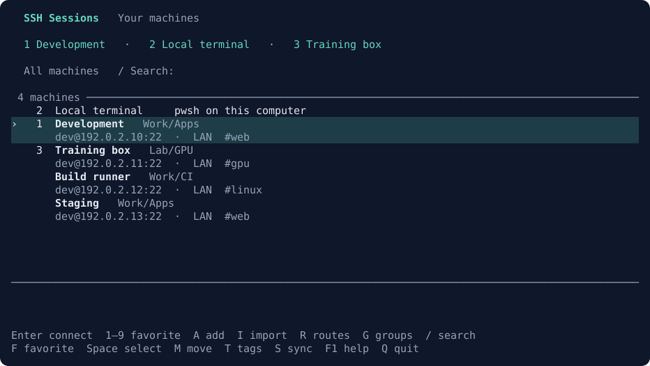
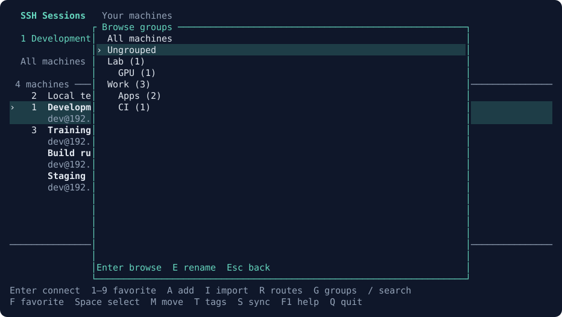
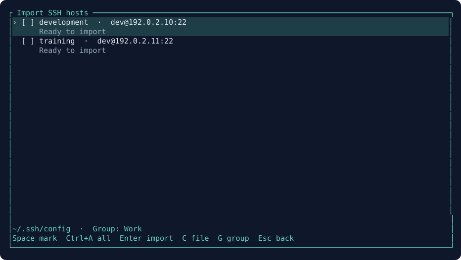
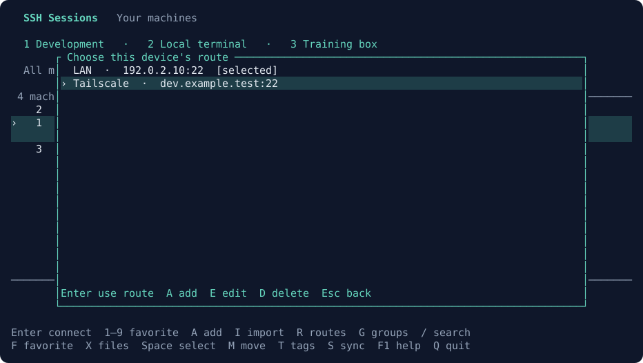

# SSH Sessions

A keyboard SSH manager with numbered favorites, machine groups and a local terminal.
Organize servers by project or location, find a machine, and press Enter to connect.



*Example machines and favorites.*

## Install

**Windows — paste into PowerShell:**

```powershell
irm https://raw.githubusercontent.com/brant92good/ssh-session-tui/main/install.ps1 | iex
```

**macOS / Linux — paste into your terminal:**

```sh
curl -fsSL https://raw.githubusercontent.com/brant92good/ssh-session-tui/main/install.sh | sh
```

Then run **`ssh-sessions`**. If the command is not found, open a new terminal.
The installer downloads its own Python and dependencies; Python and Git do not
need to be installed first. It adds the app command to your user PATH. Rerun
the same command to update. Machines and device preferences are kept separately.

Connecting needs the **OpenSSH client** (`ssh`). Git is optional and used only
for catalog sync. Installation never asks for a server. [Setup details,
noninteractive options and uninstall](docs/install.md).

Press **A** to add a machine, or **I** to import hosts from your SSH config.
Select a row and press **Enter**. SSH uses your existing login settings.
After logout, you return to the list. **Local terminal** opens a shell on this
computer; `exit` returns to the picker.

See [verification](docs/verification.md) for the tested platforms and limits.

## Numbered favorites

Highlight a machine or Local terminal, press **F**, choose a slot **1–9**, then
**Enter** to save. Press its **number, then Enter** to open it from any group.
The number selects the destination first. Digits in search and forms type normally.

F also lets you move or replace a favorite. **D** in that menu clears a slot.
Each item occupies one slot. Favorites are saved per device and use that device's
selected route. Your personal setup can seed an initial layout on a new laptop.

## Organize a large machine list

**G** opens the group browser. Choose a group and press Enter to show its machines
and subgroups. Group counts include all descendants. **Esc** returns to All machines.



*Groups and counts from the example catalog.*

To create a group, highlight a machine and press **M**. Enter a path such as
`Work/Production` or `Lab/GPU`, then **Ctrl+S**. A slash creates a nested group.
Leave the field blank to move a machine to Ungrouped. Groups exist while they
contain machines or subgroups.

For a batch, mark rows with **Space**, or press **Ctrl+A** to select all shown.
Then **M** moves the selection. **T** adds or removes comma-separated tags across
those machines. The selected count is shown above the list. Starting a search
or changing groups clears the selection. Group renaming is **G → E** and includes
its subgroups. To merge groups, select their machines and move them to the same path.

Press **/** to search names, addresses, usernames, group paths and tags. Combine
words or use `tag:gpu`, `group:Work` or `group:Work tag:linux`. Quotes support
spaces, such as `tag:"deep learning"`. Search applies within the current group.

Groups and tags travel with the shared catalog. Numbered favorites and route
choices remain per device. Catalogs with groups/tags use version 2: upgrade each
copy of SSH Sessions to **0.4 or newer** before sharing organized catalogs.

## Import existing SSH hosts

Press **I**, use **Space** to select hosts or **A** for all, then **Enter** to
import. Enter with no marked rows imports the highlighted host. Tab reaches
the config path; Enter reloads it. New machines join the current group.



*Example SSH config.*

Import reads named hosts, addresses, usernames and ports, including static
Include files. Imported routes use the original SSH alias, keeping its proxy,
jump-host and key settings available to OpenSSH. Existing machine names, groups
and tags are preserved. Re-importing an alias updates its local config binding;
changed destination values are flagged for review. See [import details](docs/ssh-import.md).

## Use different routes on different computers

A machine can have several named routes: for example, LAN at home and Tailscale
on a laptop. Press **R** to add routes and choose one for this device. With one
route, Enter uses it; with several and no selection, the route chooser opens.



If SSH fails, choose an alternative route to retry once, or Esc to return.
Trying an alternative leaves the saved route preference unchanged. Cloudflare,
VPN and jump-host routes use the configuration already installed on that computer.

| Key | Action |
| --- | --- |
| Arrows, Enter | Choose a machine or local terminal and open it |
| 1–9, Enter / F | Open / edit numbered favorites |
| G | Browse groups; E in the browser renames a group |
| Space / Ctrl+A | Select one machine / all shown |
| M / T | Move selected machines / edit their tags |
| / / Esc | Search / clear filters and selection |
| A / E / D | Add / edit / delete a machine |
| R / I | Routes / SSH import |
| S | Pull / Publish |
| F5 / F1 | Reload / keyboard guide |
| Ctrl+L / Q | Local shell / close picker |

Forms use Tab to move, Ctrl+S to save and Esc to cancel.

## Share a catalog through Git

Choose a catalog file in a private Git checkout:

```powershell
.\.venv\Scripts\python.exe app.py --catalog C:\MySetup\connections\catalog.json init
# Add and commit that file, and configure the repository's Git upstream.
.\.venv\Scripts\python.exe app.py --catalog C:\MySetup\connections\catalog.json
```

**S → P** pulls the repository with a fast-forward merge. Commit or stash local
changes first. **S → U** commits and pushes the catalog file. If the branch has
unpublished changes to other files, publish those with your normal Git workflow.
Resolve conflicting edits with Git before retrying sync.

Without `--catalog`, Windows stores the catalog under `%LOCALAPPDATA%\SSHSessions`.
See [data format and sync behavior](docs/design.md) for file locations and fields.

## Windows Terminal integration

[Terminal Workspace](https://github.com/brant92good/terminal-workspace) includes
SSH Sessions. From that checkout:

```powershell
.\install.ps1 -IntegrationOnly -SessionPicker -NewTabShortcut ctrl+n
```

New tabs open the picker. **Ctrl+N** becomes an additional new-tab shortcut;
**Ctrl+Alt+N** opens local PowerShell directly. Omit `-NewTabShortcut` to keep your
current key bindings. Terminal owns these shortcuts, including when a shell or
editor is running inside the tab.

## Commands for scripts and agents

```powershell
.\.venv\Scripts\python.exe app.py list --group Work --tag gpu --json
.\.venv\Scripts\python.exe app.py groups list --json
.\.venv\Scripts\python.exe app.py organize --machine MACHINE_ID --group Work/Production --add-tag gpu --json
.\.venv\Scripts\python.exe app.py organize --machine MACHINE_ID --ungrouped --json
.\.venv\Scripts\python.exe app.py groups rename Work Projects --json
.\.venv\Scripts\python.exe app.py import-ssh --apply --host SSH_ALIAS --group Lab --json
.\.venv\Scripts\python.exe app.py favorites set 1 --machine MACHINE_ID --json
.\.venv\Scripts\python.exe app.py favorites set 2 --local --json
.\.venv\Scripts\python.exe app.py command MACHINE_ID --json
.\.venv\Scripts\python.exe app.py doctor --json
```

Repeat `--machine` for bulk edits. `--add-tag` and `--remove-tag` also repeat.
`command` prints the SSH argument list for inspection. `list`, `groups`,
`organize`, `favorites` and `import-ssh` manage catalog data; the interactive
picker starts sessions. Global `--catalog` and `--state-dir` options come before
the command.

[Development guide](AGENTS.md) · [Verification](docs/verification.md) ·
[Backlog](docs/backlog.md) · [MIT license](LICENSE)
