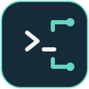

# SSH Sessions

**One server list. Your route on each device.**

Stop saving the same server as three different machines. Keep its LAN, VPN and
tunnel addresses together, then choose the route each computer should use.
Open a favorite with **1, Enter**, search the rest, and get back to the list when
you log out. Your existing SSH client handles the connection.

[](https://github.com/brant92good/ssh-session-tui/actions/workflows/native.yml)
[](LICENSE)

[Install](#install) · [Keys](docs/usage.md) · [SSH import](#use-the-hosts-you-already-have) · [Commands for agents](#commands-for-scripts-and-agents)


*Rendered from the Rust app with example machines. No live connections in this image.*

## Install

**Windows — paste into PowerShell:**

```powershell
powershell -NoProfile -ExecutionPolicy Bypass -Command "irm https://raw.githubusercontent.com/brant92good/ssh-session-tui/v0.6.0/install.ps1 | iex"
```

**Linux / macOS:**

```sh
curl -fsSL https://raw.githubusercontent.com/brant92good/ssh-session-tui/v0.6.0/install.sh | sh
```

Run **`ssh-sessions`** in a new terminal. Press **I** to import SSH hosts or **A**
to add your first machine. There is no server question during installation.

The installer downloads a compiled Rust binary and checks its SHA-256 checksum.
No Python, Rust compiler or Git is required. You need OpenSSH (`ssh`) to connect;
Git is optional for sharing a catalog. [Install, update and uninstall](docs/install.md).

| Platform | Binary | Status |
| --- | --- | --- |
| Windows 10/11 | x64 | Native console / Windows Terminal |
| Linux | x64, ARM64 | Native terminal; static binary |
| macOS | Apple Silicon, Intel | **Beta** — hosted terminal tests, desktop qualification ongoing |

See [verification](docs/verification.md) for exactly what has been exercised.

## Use the hosts you already have

Press **I**, preview the names in your SSH config, select with **Space**, then
**Enter**. Imported routes retain their SSH aliases, so your jump hosts, proxies
and identity settings still apply. Import also accepts a different config file.

Or use **A** and enter a name, username and address. Select the machine and press
**Enter** to connect. Type `exit` in the remote shell to return to the picker.
**Local terminal** opens your local shell and returns in the same way.

[Import details and repeat imports](docs/ssh-import.md).

## One machine, several ways in

Add **LAN**, **Tailscale** or other named routes under one server. Press **R** to
choose this computer's route. Share the catalog through an explicit Git pull or
publish; each device keeps its own route choice and numbered favorites.


A failed connection shows the alternatives. You choose whether to try one;
the app never silently switches routes or replaces your saved preference.

## Favorites for the daily work. Groups for the rest.

Select a machine or Local terminal, press **F**, choose **1–9**, then **Enter** to save. On the main
list, the number selects that favorite and **Enter** connects. Favorites work
across groups, so your regular machines stay reachable while you browse.

**G** opens nested groups such as `Work/Production`. **/** searches names, routes,
groups and tags; try `group:Work tag:gpu`. **Space** marks machines, **M** moves
them, and **T** changes their tags in one edit.

<details>
<summary>Keyboard reference and group browser</summary>


| Key | Action |
| --- | --- |
| Arrows, Enter | Select and open a session |
| 1–9, Enter / F | Open / assign a favorite |
| G / / | Browse groups / search |
| A / E / D | Add / edit / delete a machine |
| R / I | Choose a route / import SSH hosts |
| Space / Ctrl+A | Mark one machine / all shown |
| M / T | Move machines / edit tags |
| S | Pull or publish the catalog |
| Ctrl+L | Open the local shell |
| F1 / Q | Help / close the picker |

Forms use **Tab**, **Ctrl+S** to save, and **Esc** to cancel.
[Full usage guide](docs/usage.md).

</details>

## Who might find this useful?

- You move between a desktop and laptop that reach the same servers differently.
- Your SSH config has become a list you search through before every connection.
- You want project or lab groups without maintaining a separate SSH client setup.
- You use coding agents and want the same saved machines available through JSON commands.

## Commands for scripts and agents

```sh
ssh-sessions doctor --json
ssh-sessions list --json
ssh-sessions groups list --json
ssh-sessions command MACHINE_ID --json
```

`list` returns stable machine IDs. `command` returns an argument array for your
SSH client without connecting. Import, favorites and bulk organization also have
CLI commands. [Automation examples](docs/usage.md#commands-for-scripts-and-agents)
and [AGENTS.md](AGENTS.md) document the boundaries and checks.

## Make it your new-tab screen

[Terminal Workspace](https://github.com/brant92good/terminal-workspace) can start
this picker in new Windows Terminal tabs while giving local PowerShell its own
shortcut. It also pairs remote sessions with
[Port Forward TUI](https://github.com/brant92good/port-forward-tui).
SSH Sessions works independently of that integration.

This is a machine organizer and SSH handoff. It does not add SFTP, credential
sync or a terminal multiplexer. [Data format](docs/design.md) ·
[Build and test](docs/verification.md) · [Report an issue](https://github.com/brant92good/ssh-session-tui/issues)
