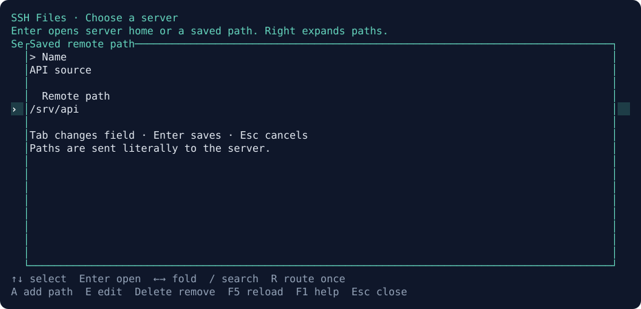
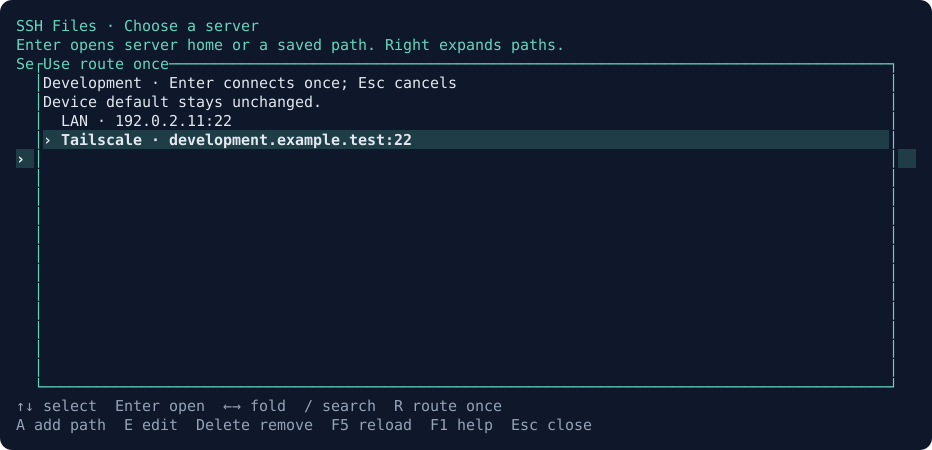

# Using SSH Sessions

[Back to the README](../README.md)

## Numbered favorites

Highlight a machine or Local terminal, press **F**, choose a slot **1–9**, then
**Enter** to save. Press its **number, then Enter** to open it from any group.
The number selects the destination first. Digits in search and forms type normally.

F also lets you move or replace a favorite. **D** in that menu clears a slot.
Each item occupies one slot. Favorites are saved per device and use that device's
selected route. Your personal setup can seed an initial layout on a new laptop.

## Organize a large machine list

**G** opens the group browser. Choose a group and press Enter to show its machines
and subgroups. Group counts include all descendants. **Esc** closes the browser;
from the main list, it returns to All machines.
Inside the browser, **/** or **Tab** focuses the group search. Type part of a path,
press **Enter** to return to the filtered list, then **Enter** to browse that group.


*Groups and counts from the example catalog.*

To create a group, highlight a machine and press **M**. Enter a path such as
`Work/Production` or `Lab/GPU`, then **Ctrl+S**. A slash creates a nested group.
Leave the field blank to move a machine to Ungrouped. Groups exist while they
contain machines or subgroups.

For a batch, mark rows with **Space**, or press **Ctrl+A** to select all shown.
Then **M** moves the selection. **T** adds or removes comma-separated tags across
those machines. The selected count is shown above the list. Starting a search
or changing groups clears the selection. Group renaming is **G → E** and includes
its subgroups. To merge groups, select their machines and move them to the same path.

Press **/** to search names, addresses, usernames, group paths and tags. Combine
words or use `tag:gpu`, `group:Work` or `group:Work tag:linux`. Quotes support
spaces, such as `tag:"deep learning"`. Search applies within the current group.

Groups and tags travel with the shared catalog. Numbered favorites and route
choices remain per device. Catalogs with groups/tags use version 2: upgrade each
copy of SSH Sessions to **0.4 or newer** before sharing organized catalogs.

## Import existing SSH hosts

Press **I**, use **Space** to select hosts or **A** for all, then **Enter** to
import. Enter with no marked rows imports the highlighted host. Tab reaches
the config-path form; Enter reloads it. **C** opens that form too, and **G** chooses
the import group. New machines join the current group by default.


*Example SSH config.*

Import reads named hosts, addresses, usernames and ports, including static
Include files. Imported routes use the original SSH alias, keeping its proxy,
jump-host and key settings available to OpenSSH. Existing machine names, groups
and tags are preserved. Re-importing an alias updates its local config binding;
changed destination values are flagged for review. See [import details](ssh-import.md).

## Use different routes on different computers

A machine can have several named routes: for example, LAN at home and Tailscale
on a laptop. Press **R** to add routes and choose one for this device. With one
route, Enter uses it; with several and no selection, the route chooser opens.


If SSH fails, choose an alternative route to retry once, or Esc to return.
Trying an alternative leaves the saved route preference unchanged. Cloudflare,
VPN and jump-host routes use the configuration already installed on that computer.

## Open the file browser

Select a remote machine and press **X**. With several routes and no device
selection, choose one first. The companion opens in the current tab and starts
its local pane in the current working directory. Closing it returns to the
picker; it does not start an SSH shell or try an alternative route automatically.

[SSH Files](https://github.com/brant92good/ssh-files) is an optional compiled
companion. SSH Sessions looks for it beside its own executable, then on PATH.
Set `SSH_FILES_BIN` to an absolute executable path to use a specific installation;
an invalid override reports an error instead of choosing another copy.

The handoff preserves the machine's imported SSH alias, explicit hostname,
username, port and local config path. That selected route stays fixed for the
file-browser session even if another picker changes device preferences.
Files uses noninteractive SSH: complete first-time login, host-key acceptance
and key-agent setup through **Enter** before opening Files.

For scripts, `ssh-sessions files MACHINE_ID --route ROUTE_ID --json` returns
`argv`, `machine_id` and `route_id` without launching or probing an executable,
connecting, or saving settings. It errors if the companion is missing, the
route is ambiguous, or the imported alias is unavailable. Without `--json`,
the command opens the companion and waits for it to close.

### Files chooser

This feature requires 0.8 or newer. Run **`ssh-sessions files`** without a machine argument.
Use the same `--catalog` option as your normal SSH picker if you keep a custom
catalog. The chooser lists its groups and servers without making a connection.

- **Enter** on a group expands or folds it. On a server it opens home; on a saved
  path it opens that directory. **Right** on a server reveals its saved paths.
- **A** adds a named path for the selected server. **E** edits a selected path.
  Use **Tab** between Name and Remote path, **Enter** to save, then **Esc** to
  return to the list. Saving does not open a connection.
- **Delete** asks before removing a saved path. Press **Delete** again to confirm;
  this removes the shortcut, not a server file.
- **R** chooses a route for this session only. Change the device default in the
  normal SSH picker. A failed connection never tries another route for you.
- **/** searches servers and saved paths; **F5** reloads edits from other tabs.
  **F1** shows keys; **Esc** clears a search, closes a dialog, or closes the chooser.

Paths are literal SFTP paths. For example, use `/srv/api` for a project directory;
the chooser does not expand `~` or `$HOME`. A stale edit stays in its dialog with
your text intact. A malformed saved-path file leaves server-home browsing usable
and reports why saved paths are unavailable.



The route dialog applies only to the Files session you are opening:



An explicit command can also specify a remote directory:

```sh
ssh-sessions files MACHINE_ID --route ROUTE_ID --remote='/srv/project files' --json
```

With `--json`, a machine is required and the command only prints validated
arguments. Without it, the same explicit command opens the companion directly.

## Main SSH picker keys

| Key | Action |
| --- | --- |
| Arrows, Enter | Choose a machine or local terminal and open it |
| 1–9, Enter / F | Open / edit numbered favorites |
| G | Browse groups; E in the browser renames a group |
| Space / Ctrl+A | Select one machine / all shown |
| M / T | Move selected machines / edit their tags |
| / / Esc | Search / clear filters and selection |
| A / E / D | Add / edit / delete a machine |
| R / I | Routes / SSH import |
| X | Open SSH Files for the selected machine and route |
| S | Pull / Publish |
| F5 / F1 | Reload / keyboard guide |
| Ctrl+L / Q | Local shell / close picker |

Forms use Tab to move, Ctrl+S to save and Esc to cancel.

## Share a catalog through Git

Choose a catalog file in a private Git checkout:

```powershell
ssh-sessions --catalog C:\MySetup\connections\catalog.json init
# Add and commit that file, and configure the repository's Git upstream.
ssh-sessions --catalog C:\MySetup\connections\catalog.json
```

**S → P** pulls the repository with a fast-forward merge. Commit or stash local
changes first. **S → U** commits and pushes the catalog file. If the branch has
unpublished changes to other files, publish those with your normal Git workflow.
Resolve conflicting edits with Git before retrying sync.

In **0.8+**, explicit sync also includes named remote paths in
`catalog.json.files.json` (or your catalog's full filename plus `.files.json`).
The file is created only when you save a path. Publish includes exactly those
two metadata files and preserves unrelated staged changes; it does not include
device route preferences, favorites or custom SSH-config bindings. Pull validates
the incoming files before changing your checkout. Other devices need this newer
version to use and publish saved paths; 0.7.0 only understands catalog sync.

Without `--catalog`, Windows stores the catalog under `%LOCALAPPDATA%\SSHSessions`.
See [data format and sync behavior](design.md) for file locations and fields.

## Commands for scripts and agents

```powershell
ssh-sessions list --group Work --tag gpu --json
ssh-sessions groups list --json
ssh-sessions organize --machine MACHINE_ID --group Work/Production --add-tag gpu --json
ssh-sessions organize --machine MACHINE_ID --ungrouped --json
ssh-sessions groups rename Work Projects --json
ssh-sessions import-ssh --apply --host SSH_ALIAS --group Lab --json
ssh-sessions favorites set 1 --machine MACHINE_ID --json
ssh-sessions favorites set 2 --local --json
ssh-sessions command MACHINE_ID --json
ssh-sessions doctor --json
```

Repeat `--machine` for bulk edits. `--add-tag` and `--remove-tag` also repeat.
`command` prints the SSH argument list for inspection. `list`, `groups`,
`organize`, `favorites` and `import-ssh` manage catalog data; the interactive
picker starts sessions. Global `--catalog` and `--state-dir` options work before
or after the command.
